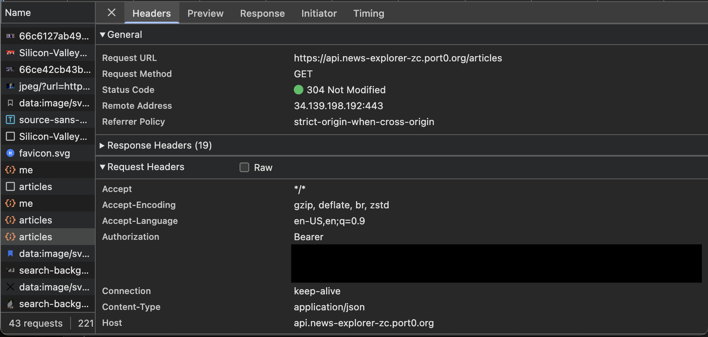
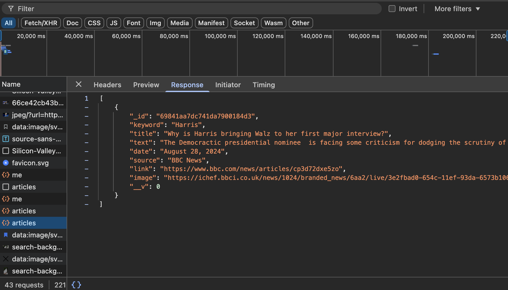

# News Explorer – Backend API

RESTful API built with Node.js, Express, and MongoDB to support user authentication and persistent storage of saved news articles.

---

## 🌍 Deployment

Backend and database are deployed on a cloud-hosted virtual machine.

---

## 📸 Screenshots




---

## 📌 Overview

This API powers the News Explorer application by handling user accounts and storing user-saved articles. Implements JWT authentication, protected routes, and structured data models.

---

## 🛠 Tech Stack

- Node.js
- Express
- MongoDB
- JWT Authentication

---

## ✨ Key Features

- User registration and login with JWT
- Protected routes for user-specific data
- CRUD operations for saved articles
- Request validation and centralized error handling
- Structured JSON API responses

---

## ⚙️ Installation

```bash
git clone https://github.com/Zchabot/news-explorer-backend.git
npm install
npm run start
```
